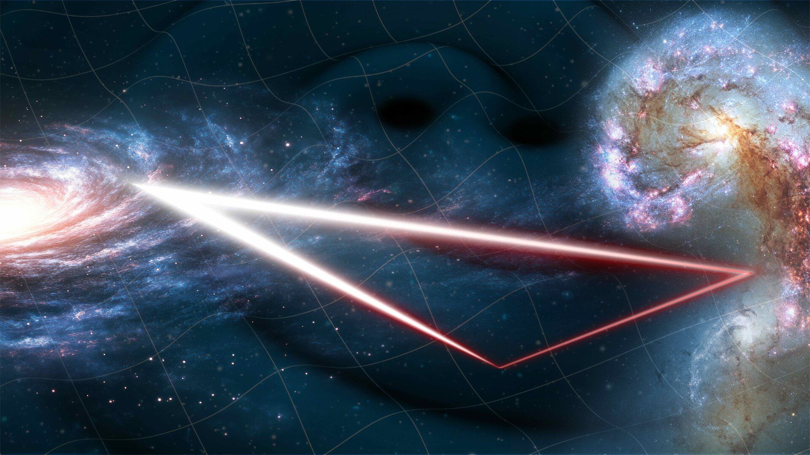

# Research

My research focuses on using gravitational waves as a probe of the dark sector of the universe. I work on both theoretical and data analysis aspects of extracting fundamental physics information from next-generation gravitational wave data including LISA, Einstein Telescope, and Cosmic Explorer.

I am paricularly interested in formation and detection scenarios for dark matter particles and fundamental fields surrounding extreme mass ratio inspirals - pairs of black holes where one is much larger than the other - and primordial black holes, tiny black holes that could have formed in the very early universe.

You can find a list of my publications <a href="https://inspirehep.net/authors/1742415" target="_blank" rel="noopener noreferrer">here</a>.

### Collaborations
I am a core member of the LISA Consortium, and I co-chair the Square Kilometre Array Observatory (SKAO) gravitational waves working group with Nicola Bellomo.

<figure style="text-align:center;">
  
  <figcaption><b>Figure 1.</b> Artist's impression of the LISA mission. Credit: ESA.</figcaption>
</figure>

